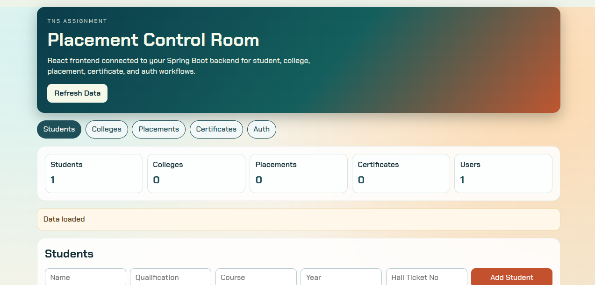
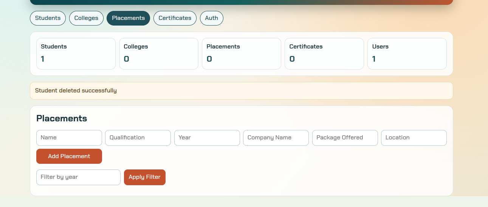
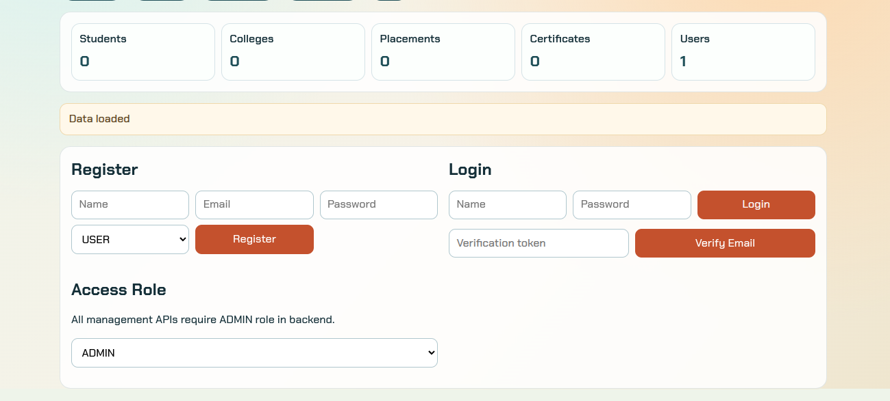

# Vettripath - Student Placement Management System

Full-stack Student Placement Management System built with Spring Boot and React.

## Why This Project Matters

Vettripath solves a common campus workflow: managing students, colleges, placements, and certificates in one system with role-protected APIs and a practical UI.

This project demonstrates end-to-end product development skills:
- Backend architecture with controllers, services, repositories, and validation
- Frontend CRUD workflows with search, filtering, and update flows
- Real database integration with PostgreSQL
- Environment-aware configuration for local and cloud-style DB usage

## Highlights

- Complete CRUD for Students, Colleges, Placements, and Certificates
- Authentication flow with register, login, and email verification
- Dashboard statistics for core entities
- Role-based API protection using `role` query parameter
- Frontend aligned with backend payloads and validation constraints

## Screenshots

Add screenshots to showcase key flows in your portfolio.

Suggested file path:
- `frontend/public/screenshots/`

Suggested captures:
- Dashboard overview
- Student create/update/search flow
- Placement management flow
- Auth (register/login/verify) flow

Template:

```md



```

## Tech Stack

- Backend: Java 17, Spring Boot 4.0.5, Spring Data JPA, Bean Validation, Maven
- Frontend: React 19, Vite 8, ESLint
- Database: PostgreSQL (local default, Neon-compatible via env vars)

## Project Structure

```text
TNS_Assignment/
├── demo/                           # Spring Boot backend
│   ├── src/main/java/com/example/demo/
│   │   ├── controller/
│   │   ├── model/
│   │   ├── repository/
│   │   ├── service/
│   │   └── config/
│   ├── src/main/resources/application.properties
│   ├── .env.properties.example
│   ├── pom.xml
│   └── mvnw
├── frontend/                       # React + Vite frontend
│   ├── src/
│   │   ├── App.jsx
│   │   └── api.js
│   ├── vite.config.js
│   └── package.json
└── README.md
```

## Core Functional Coverage

- Students: add, edit, delete, list, search by hall ticket, search by name
- Colleges: add, edit, delete, list
- Placements: add, edit, delete, list, filter by year
- Certificates: add, edit, delete, list
- Auth: register user, login, verify email token
- Dashboard: total counts for students, colleges, placements, certificates, users

## Architecture Summary

- Controller layer handles HTTP routes and request mapping
- Service layer contains business logic and access checks
- Repository layer uses Spring Data JPA for persistence
- Validation annotations enforce payload correctness
- Frontend API module centralizes request handling and error parsing

## API Notes

- Most management endpoints require query parameter `role`
- Use `role=ADMIN` for all CRUD and dashboard routes
- `ADMIN` self-registration is intentionally blocked by backend

### Auth
- `POST /auth/register`
- `POST /auth/login`
- `GET /auth/verify?token=...`

### Dashboard
- `GET /dashboard/stats?role=ADMIN`

### Students
- `POST /students?role=ADMIN`
- `PUT /students/{id}?role=ADMIN`
- `GET /students/{id}?role=ADMIN`
- `GET /students?role=ADMIN`
- `GET /students/page?role=ADMIN&page=0&size=10&sortBy=id&direction=asc`
- `GET /students/hall/{hallTicket}?role=ADMIN`
- `GET /students/name/{name}?role=ADMIN`
- `GET /students/search?role=ADMIN&name=&course=&year=`
- `DELETE /students/{id}?role=ADMIN`

### Colleges
- `POST /colleges?role=ADMIN`
- `PUT /colleges/{id}?role=ADMIN`
- `GET /colleges/{id}?role=ADMIN`
- `GET /colleges?role=ADMIN`
- `DELETE /colleges/{id}?role=ADMIN`

### Placements
- `POST /placements?role=ADMIN`
- `PUT /placements/{id}?role=ADMIN`
- `GET /placements/{id}?role=ADMIN`
- `GET /placements?role=ADMIN`
- `GET /placements/year/{year}?role=ADMIN`
- `GET /placements/qualification/{qualification}?role=ADMIN`
- `DELETE /placements/{id}?role=ADMIN`

### Certificates
- `POST /certificates?role=ADMIN`
- `PUT /certificates/{id}?role=ADMIN`
- `GET /certificates/{id}?role=ADMIN`
- `GET /certificates?role=ADMIN`
- `DELETE /certificates/{id}?role=ADMIN`

## Local Setup

## Prerequisites

- Java 17 or higher
- Node.js 18+ and npm
- PostgreSQL running locally on port 5432, or Neon credentials

### Linux Java Setup

If you see errors like `class file version mismatch` or `release version 17 not supported`, your shell is likely using an older Java.

Install and select JDK 21:

```bash
sudo apt update
sudo apt install -y openjdk-21-jdk
sudo update-alternatives --config java
sudo update-alternatives --config javac
java -version
javac -version
```

Expected: both versions should be 17 or higher.

If `java -version` still shows 8 after switching alternatives, check shell overrides:

```bash
grep -nE 'JAVA_HOME|java-8-openjdk|PATH=.*java' ~/.bashrc ~/.profile ~/.bash_profile 2>/dev/null
```

Then set:

```bash
export JAVA_HOME=/usr/lib/jvm/java-21-openjdk-amd64
export PATH=$JAVA_HOME/bin:$PATH
```

## Backend Setup

```bash
cd demo
cp .env.properties.example .env.properties
./mvnw spring-boot:run
```

Backend runs at `http://localhost:8080`.

## Frontend Setup

```bash
cd frontend
npm install
npm run dev
```

Frontend runs at `http://localhost:5173`.

Vite proxy forwards `/api/*` to `http://localhost:8080`.

## Configuration

Backend config file:
- `demo/src/main/resources/application.properties`

Local secrets file:
- `demo/.env.properties`
- Template: `demo/.env.properties.example`

Important env keys:
- `NEON_JDBC_URL`
- `NEON_DB_USER`
- `NEON_DB_PASSWORD`
- `APP_MAIL_USERNAME`
- `APP_MAIL_PASSWORD`
- `APP_VERIFICATION_BASE_URL`

## Validation Commands

Backend:

```bash
cd demo
./mvnw test
```

Frontend:

```bash
cd frontend
npm run lint
npm run build
```

## Troubleshooting

### Frontend shows `502 Bad Gateway` on `/api/*`

Cause:
- Backend is not running on port 8080

Fix:
- Start backend first with `./mvnw spring-boot:run`
- Confirm backend port with `ss -ltn '( sport = :8080 )'`

### Backend compiles fail with Java class version errors

Cause:
- Java runtime or compiler is older than required

Fix:
- Use JDK 17+ for both `java` and `javac`

## Resume-Ready Talking Points

- Built and integrated a multi-module full-stack application with role-protected APIs
- Designed entity workflows spanning 4 business modules with complete CRUD and validations
- Implemented frontend-backend contract alignment and robust API error handling
- Added email verification and dashboard analytics endpoints for practical product behavior

## Roadmap

- Replace role query parameter with token-based authorization
- Add automated backend integration tests and frontend component tests
- Add pagination and advanced filtering on all list views
- Add deployment manifests for one-command cloud deployment

## License

This project is part of TNS Assignment.
